# Projeto Massa

O algoritmo MASSA ("Molecular dAta Set SAmpling Algorithm") visa automatizar a divisão de conjuntos de dados de moléculas em conjuntos de treinamento e teste para modelagem QSAR/QSPR. Ele utiliza informações sobre a estrutura da molécula, propriedades físico-químicas e atividades biológicas para realizar uma amostragem racional e representativa do espaço químico, visando gerar modelos mais robustos e preditivos, evitando vícios e otimizando a cobertura do espaço químico durante a construção do modelo.

Para torná-lo acessível a um público mais amplo, para o Projeto MASSA está sendo desenvolvida uma interface de usuário amigável em formato de aplicação web. Hospedado o front-end no Netlify e o back-end e o banco no Heroku, a aplicação permitirá que usuários sem conhecimento em programação possam facilmente carregar seus conjuntos de dados, configurar parâmetros e visualizar os resultados de forma clara e interativa. Além disso, o código do algoritmo MASSA será otimizado, utilizando os princípios de "clean code" e as diretrizes definidas no PEP 8, resultando em um código mais legível, modular e de fácil manutenibilidade, o que facilita futuras colaborações e implementação de novas funcionalidades.

Com o Projeto MASSA, a comunidade científica terá acesso facilitado a essa poderosa ferramenta, impulsionando a pesquisa e o desenvolvimento de novas moléculas bioativas não só mas principalmente na área farmacêutica. A iniciativa consolida o compromisso com o avanço científico e a disseminação do conhecimento, democratizando o acesso a ferramentas avançadas de modelagem molecular.

## Alunos integrantes da equipe

* Douglas Galvão Machado
* Gabriel Ramos Ferreira
* João Pedro Silva Braga
* João Vitor Romero Sales
* Lucas Randazzo

## Professores responsáveis

* Soraia Lucia da Silva
* Joana Gabriela

## Interface da Aplicação Web

### Tela Inicial

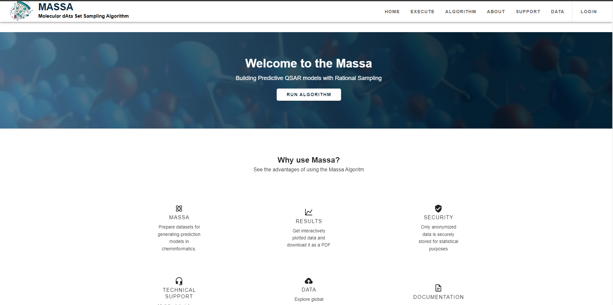

A tela inicial apresenta o software e um botão para executar o algoritmo.  Oferece também links para outras seções do site, como informações sobre o algoritmo, dados, suporte e login.

### Tela de Login

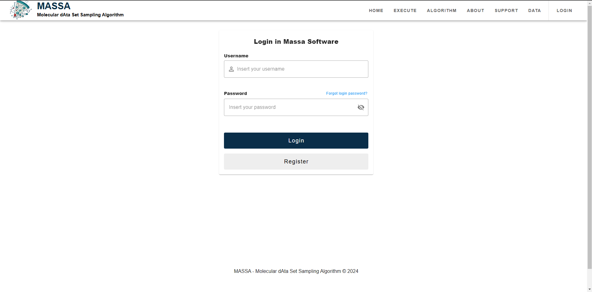

Permite o acesso de usuários cadastrados ao software. O campo de senha possui validação de quantidade mínima de caracteres.

### Tela de Registro

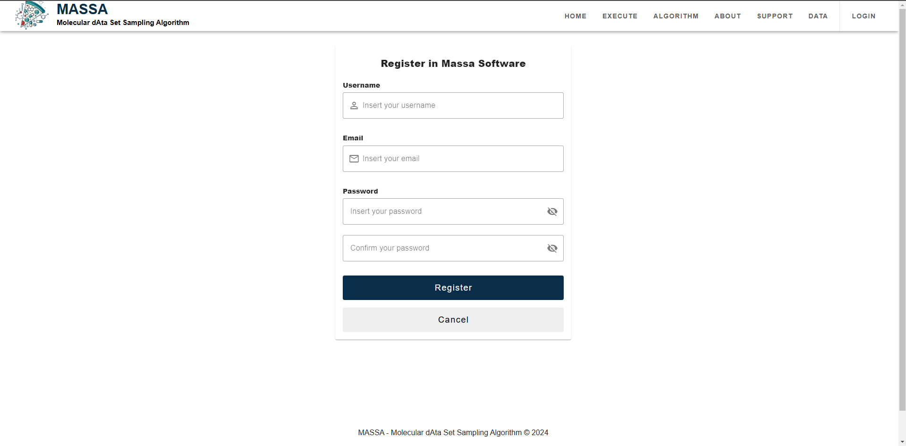

Nesta tela, novos usuários podem se cadastrar no software, fornecendo informações como nome de usuário, email e senha. Campos de senha incluem validação de quantidade mínima de caracteres e o campo de e-mail possui validações para que o e-mail fornecido seja válido.

### Tela de Upload de arquivos

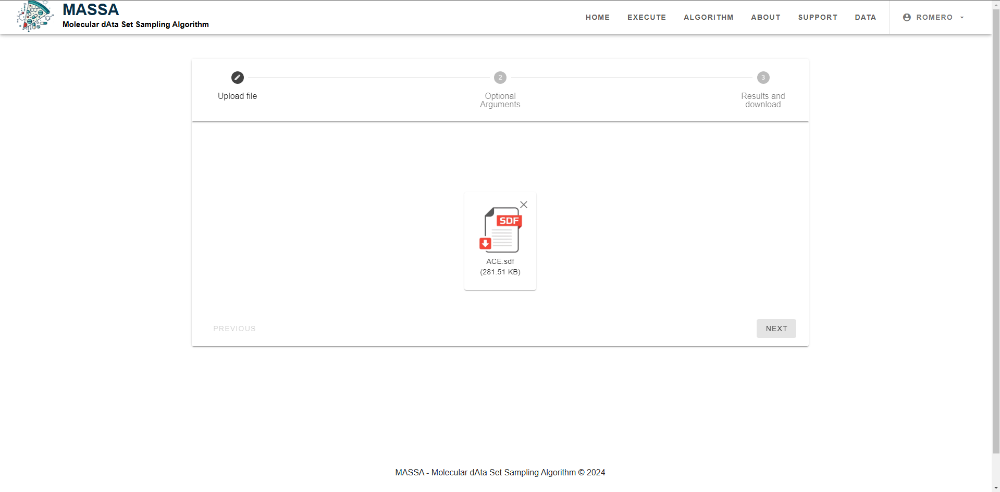

Nesta página o usuário realiza o upload do arquivo em um dos formatos permitidos (SDF, MOL, MOL2, XLSX, XLS, e CSV) contendo o conjunto de dados moleculares a serem analisados.

### Tela de Parâmetros de Execução

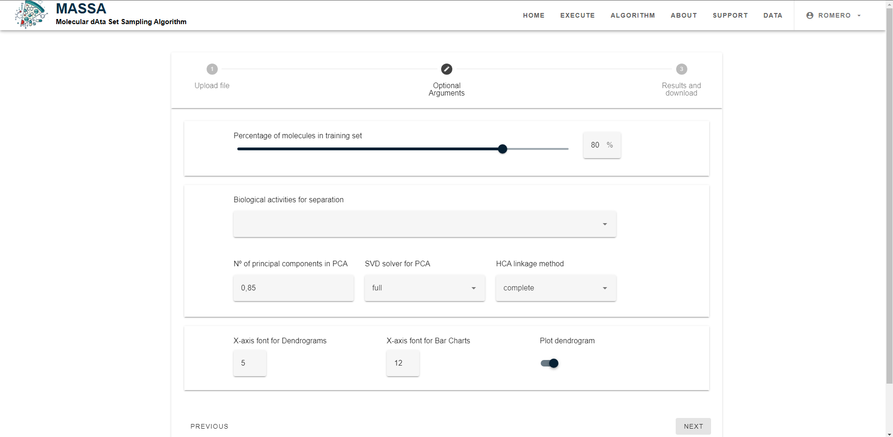

Aqui, o usuário configura os parâmetros para a execução do algoritmo, como percentual de moléculas no conjunto de treinamento, atividades biológicas para separação, número de componentes principais no PCA e método de linkage para HCA.

### Tela de Resultados

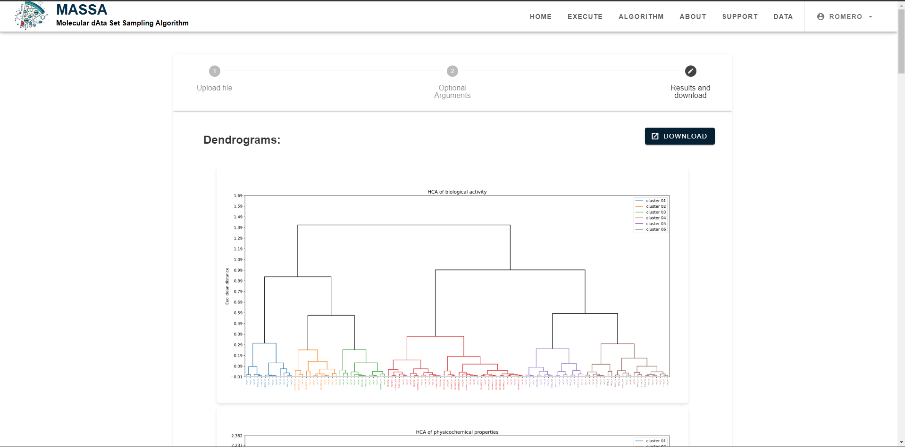

Após a execução do algoritmo, esta tela exibe os resultados da amostragem, estatísticas e visualizações gráficas. Além de permitir o download dos resultados em formato de PDF.

### Tela de Dados do Usuário

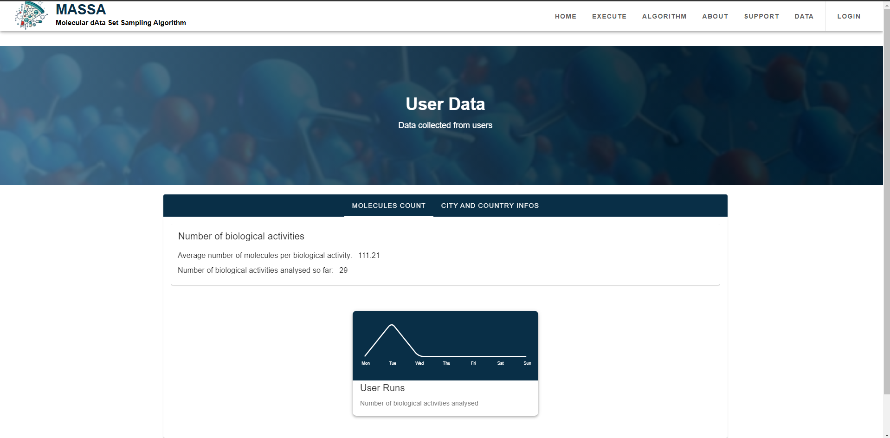
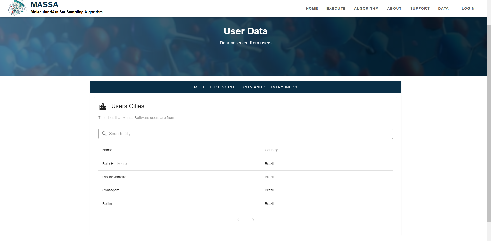

Apresenta estatísticas de uso do software, incluindo informações sobre as análises realizadas e a localização geográfica dos usuários.

### Tela "Sobre o Algoritmo"

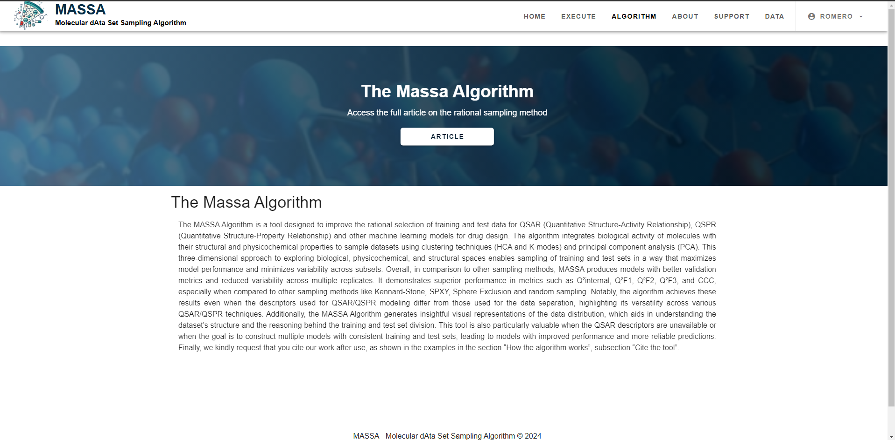

Descreve o funcionamento do algoritmo MASSA e suas vantagens em relação a outros métodos de amostragem.

### Tela "Sobre a Equipe"

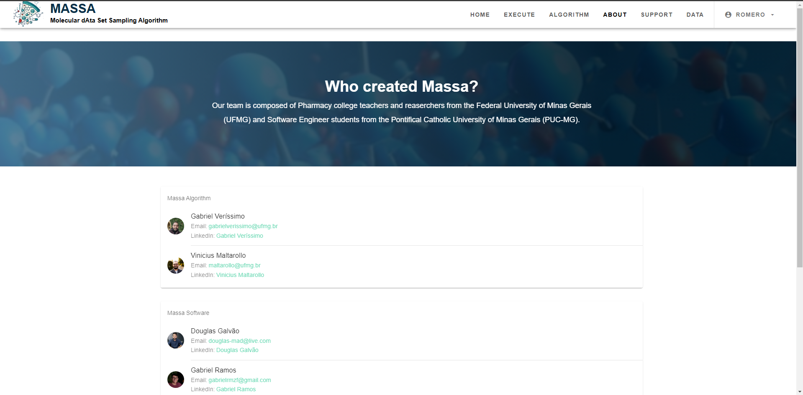

Apresenta os membros da equipe responsáveis pelo desenvolvimento do algoritmo e do software Massa.

### Tela de Suporte
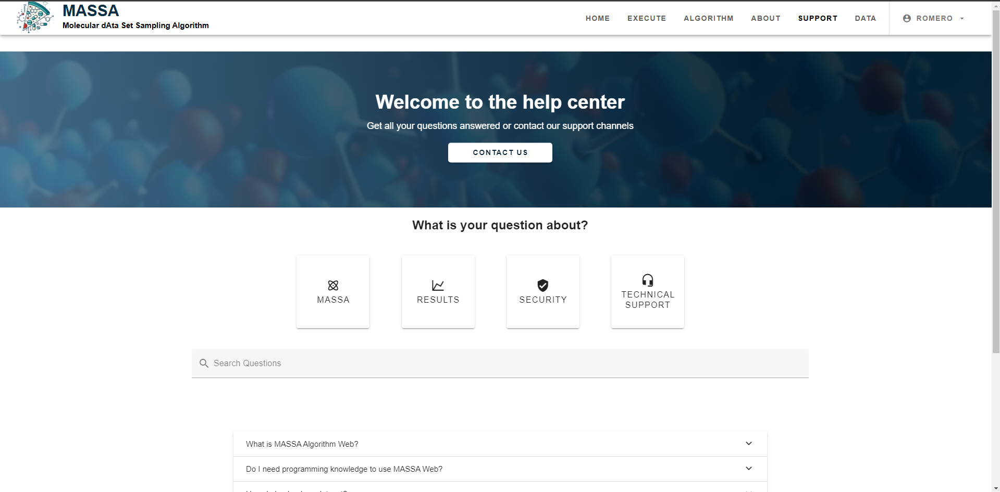
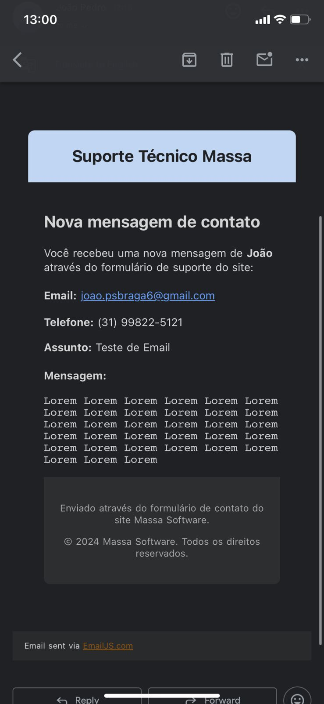

Central de ajuda com perguntas frequentes e opções de contato para suporte técnico. Também contém um print de como um e-mail enviado por esta aba de suporte chega aos stakeholders do Massa.

## Instruções de utilização

O projeto foi totalmente deployado, e para acessá-lo basta acessar o seguinte link: https://massa-web.netlify.app/
